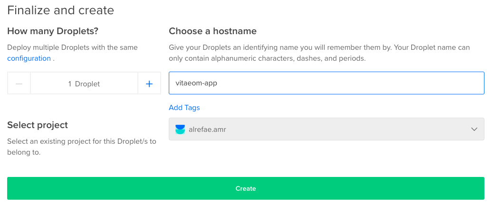

# Step 0: Unzip `app.zip` file

Once your payment has been verified by Envato (Codecanyon), you will be redirected to a page where you can download Vitaeom. The folder you'll download will need to be unzipped to extract the containing files and folders to be used in setting up Vitaeom on your server of choice. Here's what you need to do:

1. Right-click on the downloaded file `app.zip`.
2. Select extract contents.
3. Wait for the extraction and unzipping process to finalize.
4. That's it! For now, move on to Step 1 of the process.

# Step 1: Create DigitalOcean Server (Droplet)

For Vitaeom to function properly, you will need a vps server. Not to worry! These servers have become very affordable and easy to manage and setup. Our chosen server provider, [DigitalOcean](https://www.digitalocean.com/) is very easy to use and setup and is also very cheap and affordable! For only $5/month, you can get your own private server that you can use to setup Vitaeom on. We highly recommend the usage of DigitalOcean as your server provider.

Moving forward, our guide will help you specifically setup your version of Vitaeom on a DigitalOcean server (if you need help with setting up Vitaeom on other server provider, we might be able to help, just [contact us](https://codecanyon.net/user/asquared2)!)

- To get started, just create an account at DigitalOcean [here](https://cloud.digitalocean.com/registrations/new).

- After you have created an account, go ahead and login.
- After logging in, create a new "Droplet" by going to "Create" and clicking on Droplets in the dropdown.

- After that, you will be presented by the Choose an Image page. Choose Ubuntu (make sure to choose Ubuntu 18.04)!

- Then, scroll down to choose the size of that Image. We recommend starting off with the $5 per month Standard Droplet size.

- After that, choose a data-center that is in your current locale (city), or close to your country/city.

- Then, name your droplet something you can easily remember (e.g. vitaeom-app), and click on Create.

# Step 2: Setup DigitalOcean Server (Before Upload)

The best, most detailed explanation of setting up the droplet you just created is from DigitalOcean themselves! We only ask you follow this [link](https://www.digitalocean.com/community/tutorials/how-to-serve-flask-applications-with-uswgi-and-nginx-on-ubuntu-18-04) to setup the server you just created correctly for Vitaeom to become operational after it's upload.

Link: [How To Serve Flask Applications with uWSGI and Nginx on Ubuntu 18.04](https://www.digitalocean.com/community/tutorials/how-to-serve-flask-applications-with-uswgi-and-nginx-on-ubuntu-18-04)

After following the above guide, please return here to continue with the setup of Vitaeom.

NOTE: If this step becomes difficult or hard to follow, please contact us immediately so we can offer assistance in the matter! We would be happy to help setup the server for you!

Done? Go to the third step below.

# Step 3: Connect to droplet/server via FileZilla

To be able to connect (or SSH) into your server, you will need an FTP application that will help you do just that! We recommend using FileZilla (available on all major operating systems). Follow the steps below to download, install and setup FileZilla:

1. Download [FileZilla](https://filezilla-project.org/download.php?type=client) and install it.
2. Head over to your droplet page on DigitalOcean.
3. Copy the IP address of the droplet you just created by hovering to the left of the IP address and clicking on copy.
4. Head over to FileZilla, and at the top of the program, you will need to provide the following information: Host - Paste your IP address previously copied here, Username - Input the username you used in setting up the DigitalOcean server in Step 2 (Hint: it's not `root`!), Password - This is the password you setup for the previously mentioned Username, and finally, Port - Please input `22` here.

5. Click on QuickConnect after filling those fields correctly.
6. You should now see the contents of your previously created Droplet in the Remote Site section of FileZilla (right-side, center panel).

You're all done for Step 3, please navigate to Step 4 to upload Vitaeom to the droplet/server.

# Step 4: Upload Vitaeom to Droplet/Server

You will now upload the contents of the extracted `app` folder into your droplet. To do this, you will need to navigate to the right folder location on your server:

1. Navigate to `/home/username(your username)`
2. Copy and paste the `app` folder into this location (You can drag it into the Remote site section of FileZilla) and wait for the transfer to finalize.
3. Open a Terminal(Mac) or Command Prompt(Windows) window and SSH into your server as previously described in Step 2 (e.g. `ssh username@0.0.0.0`)
4. After inputting your password, input this command: `sudo systemctl restart app`
5. You're all done! Phew, that was long and we apologize for the long process, but on the bright side, you are all set-up and done!

#Step 5: Use Vitaeom!

You are able to navigate to the domain you used to setup your server in Step 2, and you should be able to sign-up into Vitaeom and create an account. You are now free to explore and use Vitaeom as you deem fit for your Instagram business needs.

#Thanks Again!

As a new creator on Envato (Codecanyon), we can't thank you enough for giving us a chance to demonstrate our ability. We would be happy to help you in any matter moving forward! Just contact us through our Codecanyon contact page to let us know if you have any questions or concerns: [Contact Us](https://codecanyon.net/user/asquared2).

Regards,
[aSquared2](https://codecanyon.net/user/asquared2)
